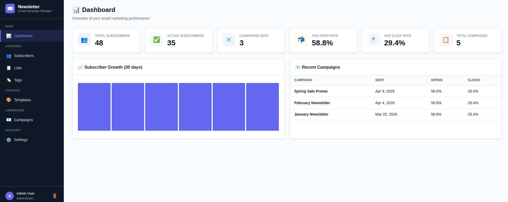
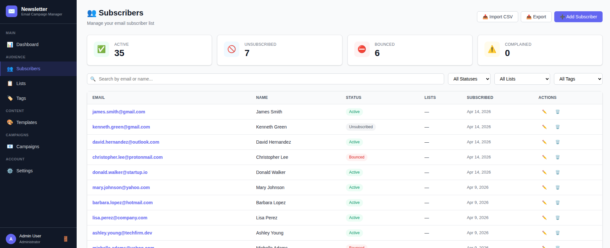
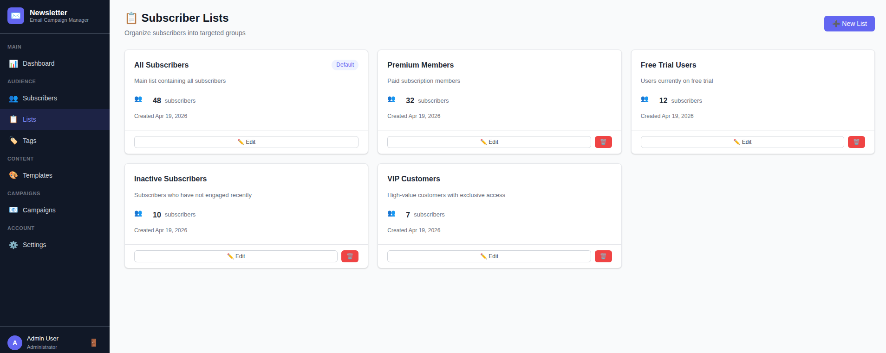
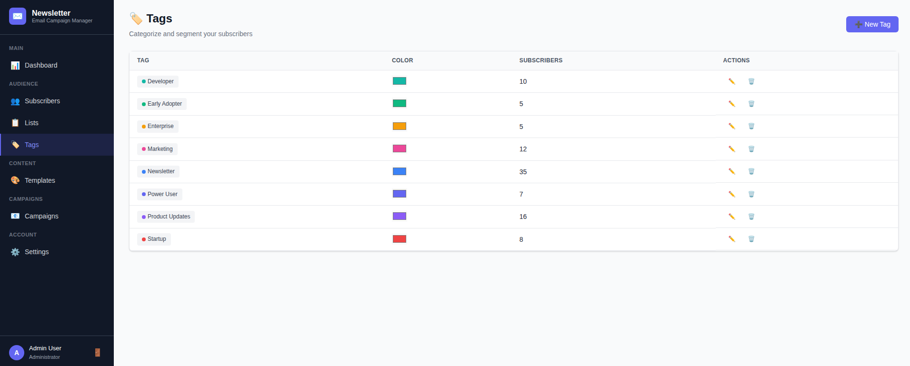
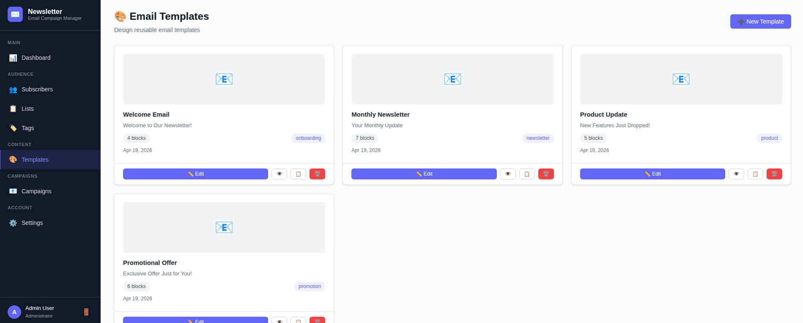
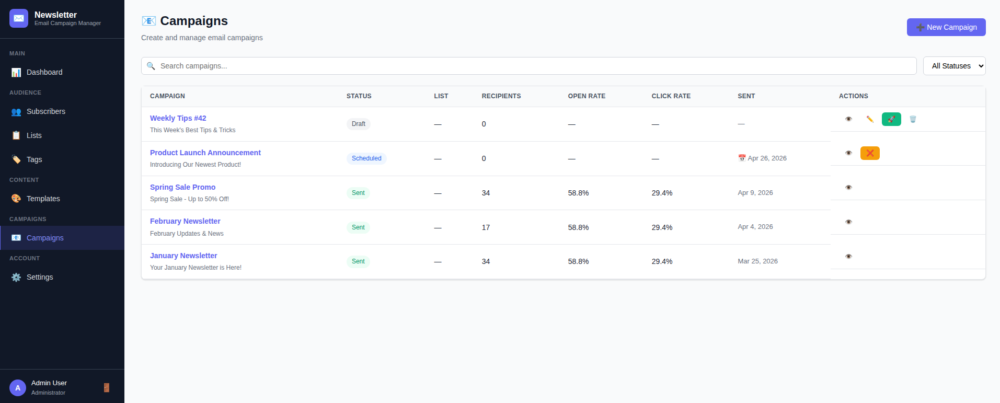
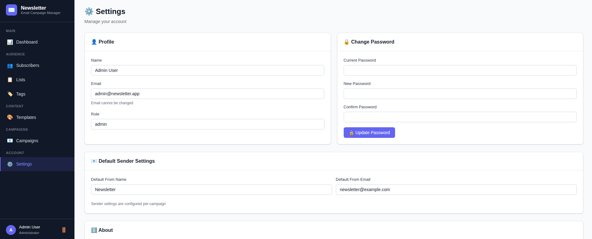
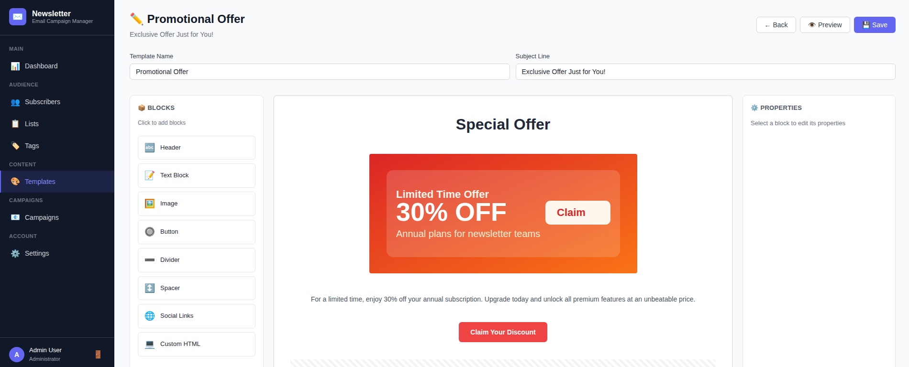

# 📧 Email Newsletter Service

A full-featured email newsletter management platform built with **Symfony 7** and **jQuery**. Create subscriber lists, design email templates with a drag-and-drop editor, manage campaigns, and track opens/clicks - all from a modern single-page admin interface.

## 🛠️ Technologies


---








---

## ✨ Features

### 📊 Dashboard
- Real-time subscriber & campaign statistics
- Subscriber growth chart
- Recent campaigns overview
- Open rate and click rate metrics

### 👥 Subscriber Management
- Full CRUD for subscribers
- Status tracking (active, unsubscribed, bounced, complained)
- Filter by status, list, tag, and search
- CSV import/export
- Per-subscriber detail with lists & tags management

### 📋 Lists & Tags
- Organize subscribers into lists
- Color-coded tags for segmentation
- Assign/remove lists and tags per subscriber

### 📝 Template Editor
- Drag-and-drop block editor powered by SortableJS
- 8 block types: Header, Text, Image, Button, Divider, Spacer, Social Links, Raw HTML
- Properties panel for each block
- Live preview of compiled email HTML
- Duplicate and manage templates

### 📤 Campaign Management
- Create campaigns: select list + template
- Send, schedule, and cancel campaigns
- Campaign detail with delivery stats
- Recipient-level tracking (sent, delivered, opened, clicked, bounced)
- Open rate & click rate progress bars

### 📈 Tracking & Analytics
- Open tracking via 1×1 pixel
- Click tracking via redirect links
- Unsubscribe handling
- Per-campaign analytics breakdown

### 🔐 Authentication
- JWT-based authentication
- Role-based access (Admin / Editor)
- Secure login/register

## 📋 Prerequisites

- **Docker** and **Docker Compose** installed on your machine
- Port **8011** available

## 🚀 Getting Started

### 1. Clone or copy the project

```bash
cd /path/to/your/projects
# Ensure the email-newsletter-service folder is present
```

### 2. Set up environment variables

```bash
cd email-newsletter-service
cp .env.example .env
```

Edit `.env` and configure your secrets (database credentials, JWT passphrase, app secret). The defaults work for local development.

### 3. Install PHP dependencies

```bash
composer install
```

### 4. Install frontend dependencies

```bash
cd frontend
npm install
cd ..
```

### 5. Build and start with Docker

```bash
docker compose build
docker compose up -d
```

This will:
- Build the PHP-FPM application image (PHP 8.4 Alpine)
- Build the Nginx image (compiles frontend with Vite, serves SPA + reverse proxies API)
- Start PostgreSQL 16 database (internal only, not exposed to host)
- Run migrations and seed demo data automatically

### 6. Access the application

| Service    | URL                        |
| ---------- | -------------------------- |
| Frontend   | http://localhost:8011      |
| API        | http://localhost:8011/api  |

### 7. Demo Accounts

| Email                     | Password      | Role   |
| ------------------------- | ------------- | ------ |
| admin@newsletter.app      | password123   | Admin  |
| editor@newsletter.app     | password123   | Editor |

## 🏗️ Architecture

```
email-newsletter-service/
├── config/                    # Symfony config (doctrine, security, JWT, CORS)
├── docker/
│   ├── nginx/
│   │   ├── Dockerfile         # Multi-stage: Node 24 → Vite build → Nginx
│   │   └── default.conf       # /api→PHP-FPM, /track→PHP-FPM, /→SPA
│   └── php/
│       ├── Dockerfile         # PHP 8.4-FPM Alpine
│       ├── entrypoint.sh      # DB wait, JWT keygen, migrations, seed
│       └── php.ini            # Production PHP config
├── frontend/
│   ├── src/
│   │   ├── css/app.css        # Comprehensive admin panel styles
│   │   └── js/
│   │       ├── app.js         # Main entry, auth guard, routing
│   │       ├── components/    # Sidebar navigation
│   │       ├── pages/         # 10 page modules (SPA)
│   │       └── utils/         # API client, router, helpers
│   ├── index.html
│   ├── package.json
│   └── vite.config.js
├── src/
│   ├── Controller/            # 9 API controllers
│   ├── Entity/                # 8 Doctrine entities
│   ├── Enum/                  # 5 enums (status types)
│   ├── Repository/            # 8 repositories with custom queries
│   ├── Service/               # 7 service classes (business logic)
│   └── DataFixtures/          # Demo data seeder
├── docker-compose.yml
└── README.md
```

### Backend Patterns
- **Service Layer**: Business logic separated from controllers
- **Repository Pattern**: Custom Doctrine repositories with typed query methods
- **Enum Types**: PHP 8.1 backed enums for statuses
- **JWT Authentication**: Stateless API auth via lexik/jwt-authentication-bundle
- **Template Compiler**: Converts JSON block structure to responsive HTML email

### API Endpoints

| Method | Endpoint                          | Description                     |
| ------ | --------------------------------- | ------------------------------- |
| POST   | `/api/auth/login`                 | Login (returns JWT)             |
| POST   | `/api/auth/register`              | Register new user               |
| GET    | `/api/auth/me`                    | Current user profile            |
| GET    | `/api/dashboard`                  | Dashboard statistics            |
| GET    | `/api/subscribers`                | List subscribers (filterable)   |
| POST   | `/api/subscribers`                | Create subscriber               |
| GET    | `/api/subscribers/:id`            | Subscriber detail               |
| PUT    | `/api/subscribers/:id`            | Update subscriber               |
| DELETE | `/api/subscribers/:id`            | Delete subscriber               |
| POST   | `/api/subscribers/import`         | Import CSV                      |
| GET    | `/api/subscribers/export`         | Export CSV                      |
| GET    | `/api/lists`                      | List subscriber lists           |
| POST   | `/api/lists`                      | Create list                     |
| PUT    | `/api/lists/:id`                  | Update list                     |
| DELETE | `/api/lists/:id`                  | Delete list                     |
| GET    | `/api/tags`                       | List tags                       |
| POST   | `/api/tags`                       | Create tag                      |
| PUT    | `/api/tags/:id`                   | Update tag                      |
| DELETE | `/api/tags/:id`                   | Delete tag                      |
| GET    | `/api/templates`                  | List templates                  |
| POST   | `/api/templates`                  | Create template                 |
| GET    | `/api/templates/:id`              | Template detail                 |
| PUT    | `/api/templates/:id`              | Update template                 |
| DELETE | `/api/templates/:id`              | Delete template                 |
| POST   | `/api/templates/:id/duplicate`    | Duplicate template              |
| GET    | `/api/templates/:id/preview`      | Preview compiled HTML           |
| GET    | `/api/campaigns`                  | List campaigns                  |
| POST   | `/api/campaigns`                  | Create campaign                 |
| GET    | `/api/campaigns/:id`              | Campaign detail + stats         |
| PUT    | `/api/campaigns/:id`              | Update campaign                 |
| DELETE | `/api/campaigns/:id`              | Delete campaign                 |
| POST   | `/api/campaigns/:id/send`         | Send campaign                   |
| POST   | `/api/campaigns/:id/schedule`     | Schedule campaign               |
| POST   | `/api/campaigns/:id/cancel`       | Cancel campaign                 |
| GET    | `/api/campaigns/:id/analytics`    | Campaign analytics              |
| GET    | `/api/campaigns/:id/recipients`   | Campaign recipients             |
| GET    | `/track/open/:id`                 | Open tracking pixel (1×1 GIF)   |
| GET    | `/track/click/:id`                | Click tracking redirect         |
| GET    | `/unsubscribe/:token`             | Unsubscribe confirmation page   |
| POST   | `/unsubscribe/:token`             | Execute unsubscribe             |

## 🐳 Docker Services

| Service  | Image              | Port  | Description                        |
| -------- | ------------------ | ----- | ---------------------------------- |
| app      | PHP 8.4-FPM Alpine | 9000  | Symfony API (internal)             |
| nginx    | Nginx Alpine       | 8011  | Reverse proxy + SPA               |
| db       | PostgreSQL 16      | —     | Database (internal only)           |

## 🔐 Security

### Authentication & Authorization
- **JWT Authentication**: Stateless API auth via RSA-signed tokens (lexik/jwt-authentication-bundle)
- **Role-Based Access**: Admin and Editor roles with different permissions
  - **Admin**: Full access including subscriber import/export/delete, campaign delete
  - **Editor**: Can manage subscribers, lists, tags, templates, and campaigns (no bulk/destructive ops)
- **Password Policy**: Minimum 12 characters, must include uppercase, lowercase, number, and special character

### Input Validation
- **XSS Prevention**: User content escaped in email templates; raw HTML blocks sanitized with tag allowlist
- **Email Validation**: Sender/reply-to addresses validated with format check and CRLF injection prevention
- **CSV Import Limits**: 5 MB file size limit, 10,000 row cap, 254-character email length check
- **Open Redirect Protection**: Click tracking only allows http/https redirect URLs

### Infrastructure
- **Security Headers**: CSP, X-Frame-Options, X-Content-Type-Options, Referrer-Policy, Permissions-Policy
- **Rate Limiting**: Login (5 attempts/15 min), API (120 requests/min), Campaign send (10/hour)
- **PHP Hardening**: `expose_php=Off`, `display_errors=Off`, secure session cookies
- **Database Isolation**: PostgreSQL is not exposed to the host network
- **Secrets Management**: All secrets in `.env` (not committed); `.env.example` provides template

### Privacy
- **Unsubscribe Flow**: Two-step confirmation (GET shows page, POST executes) to prevent drive-by unsubscribes
- **Export Audit Logging**: All subscriber exports are logged with user ID and timestamp

## 🛑 Stopping the Application

```bash
docker compose down
```

To remove all data:
```bash
docker compose down -v
```

## 📝 License

MIT License with Attribution Clause

Copyright (c) 2026

Permission is hereby granted, free of charge, to any person obtaining a copy of this software and associated documentation files (the "Software"), to deal in the Software without restriction, including without limitation the rights to use, copy, modify, merge, publish, distribute, sublicense, and/or sell copies of the Software, and to permit persons to whom the Software is furnished to do so, subject to the following conditions:

1. The above copyright notice and this permission notice shall be included in all copies or substantial portions of the Software.

2. **Attribution Clause for Commercial Use**: If this software, or any derivative work based on it, is used for commercial purposes, the following conditions must be met:
   - A visible link to [https://aaweb.tech](https://aaweb.tech) must be included in the product, website, or application (e.g., in the footer, about page, or credits section).
   - The link must be accompanied by the text: **"Built upon an original idea and codebase from [aaweb.tech](https://aaweb.tech)"** or similar attribution that clearly credits the original source.
   - This attribution is greatly appreciated and helps support the continued development of open-source projects.

THE SOFTWARE IS PROVIDED "AS IS", WITHOUT WARRANTY OF ANY KIND, EXPRESS OR IMPLIED, INCLUDING BUT NOT LIMITED TO THE WARRANTIES OF MERCHANTABILITY, FITNESS FOR A PARTICULAR PURPOSE AND NONINFRINGEMENT. IN NO EVENT SHALL THE AUTHORS OR COPYRIGHT HOLDERS BE LIABLE FOR ANY CLAIM, DAMAGES OR OTHER LIABILITY, WHETHER IN AN ACTION OF CONTRACT, TORT OR OTHERWISE, ARISING FROM, OUT OF OR IN CONNECTION WITH THE SOFTWARE OR THE USE OR OTHER DEALINGS IN THE SOFTWARE.
